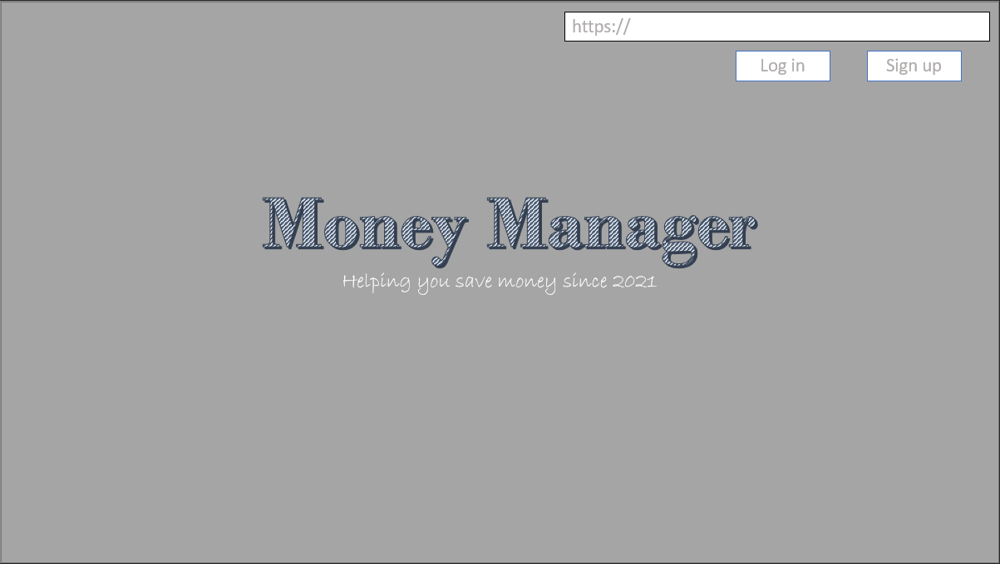
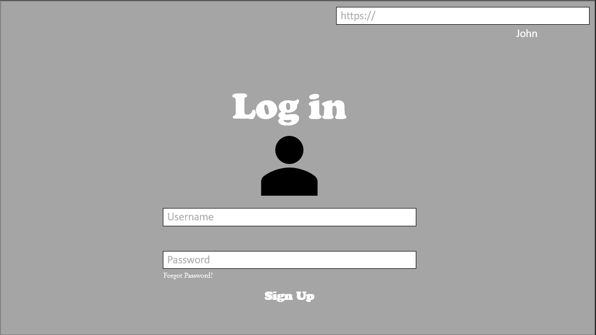
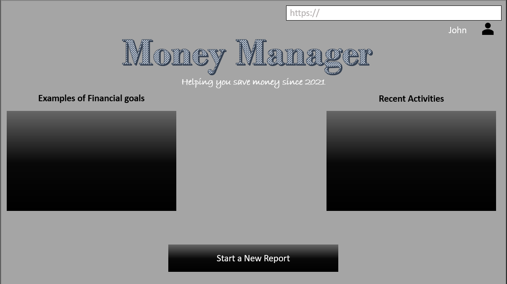
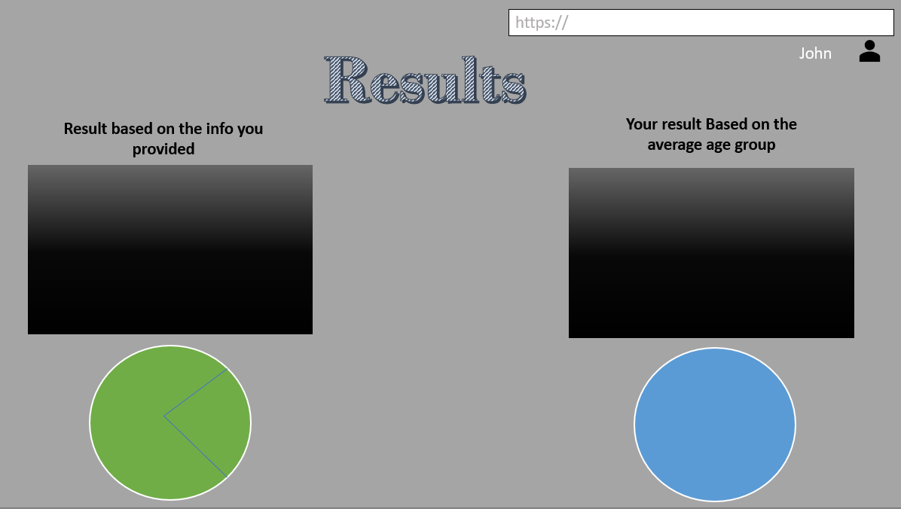

<h1>About Money Manager</h1>
<h2 id="intro">Introduction</h2>

Money Manager is a web application that helps the users visually see their finances. As they enter their weekly paycheck the application will ask for their bills and they can add or remove bills as they wish and at the end a result will be provided to them so that they can have a better idea of how they spend their money. Money Manager will allow the user to:

<ul><li>Login</li>
<li>Add their weekly paycheck</li>
<li>Add their bills</li>
<li>Separate their finances into categories, such as shopping or electronics</li>
<li>The user can decide how they will save money</li>
<li>The app will provide a chart to make the numbers easier to look at</li></ul>
<h2 id="storyboard">Storyboard</h2>

<h2 id="requirements">Functional Requirements</h2>
<h3>Requirement 100.0: Store, View and Edit Income</h3>
<h4>Scenario</h4>

As a User, I want to be able to enter the various incomes that are available to me into the application to store it, so that I can view it or edit it later. This data should be available to other parts of the application for data comparisons.

<strong>Examples:</strong>

   
<strong>1.1</strong> <strong>Given</strong> I have no stored income data in the application <strong>When</strong> I open the Money Manager Application <strong>Then</strong> I should be notified that I have no existing income data and I should be prompted to enter new income data <strong>1.2</strong> <strong>Given</strong> I enter a new income item <strong>Then</strong> I should be prompted to select the relevant additional information (e.g., amount, frequency, etc.) <strong>1.3</strong> <strong>Given</strong> I have previously stored income data in the application <strong>When</strong> I choose the View Income option <strong>Then</strong> my stored income data should be displayed in the application <strong>1.4</strong> <strong>Given</strong> I have previously stored income data in the application <strong>Given</strong> I am viewing previously stored income data <strong>When</strong> I choose the Edit option for any given income entry <strong>Then</strong> each previously entered field for that income should be editable <strong>1.5</strong> <strong>Given</strong> I have previously stored income data in the application <strong>Given</strong> I am viewing previously stored income data <strong>When</strong> I choose the Delete option for any given income entry <strong>Then</strong> the income item should be marked as deleted and removed from the list of income items <strong>1.6</strong> <strong>Given</strong> a stored income item is already existing in the Money Management Application <strong>When</strong> I attempt to add the item again <strong>Then</strong> I should receive a prompt notifying me that the item is already on the list with the option to cancel my entry, update the previously entry or add a duplicate item.

<h3>Requirement 101.0: Store, View and Edit Debts &amp; Bills</h3>
<h4>Scenario</h4>

As a User, I want to be able to enter the various debts and bills that I need to pay into the application to store it, so that I can view it or edit it later. This data should be available to other parts of the application for data comparisons.

   
<strong>1.1</strong> <strong>Given</strong> I have previously stored income data in the application <strong>Given</strong> I have no stored bills data in the application <strong>When</strong> I open the Money Management Application <strong>Then</strong> I should be notified that I have not existing bill data and I should be prompted to enter new bill data <strong>1.2</strong> <strong>Given</strong> I enter a new bill item <strong>Then</strong> I should be prompted to select the relevant additional information (e.g., amount, frequency, etc.) <strong>1.3</strong> <strong>Given</strong> I have previously stored bill data in the application <strong>When</strong> I choose the View Bill option <strong>Then</strong> my stored bill data should be displayed in the application <strong>1.4</strong> <strong>Given</strong> I have previously stored bill data in the application <strong>Given</strong> I am viewing previously stored bill data <strong>When</strong> I choose the Edit option for any given bill entry <strong>Then</strong> each previously entered field for that bill should be editable <strong>1.5</strong> <strong>Given</strong> I have previously stored bill data in the application <strong>Given</strong> I am viewing previously stored bill data <strong>When</strong> I choose the Delete option for any given bill entry <strong>Then</strong> the bill item should be marked as deleted and removed from the list of bills <strong>1.6</strong> <strong>Given</strong> a stored bill item is already existing in the Money Management Application <strong>When</strong> I attempt to add the item again <strong>Then</strong> I should receive a prompt notifying me that the item is already on the list with the option to cancel my entry, update the previously entry or add a duplicate item.

<h3>Requirement 102.0: View a Summary of Income and Bills with a Debt-to-Income Ratio Graph</h3>
<h4>Scenario</h4>

As a User, I want to be able to see a summary of my total income vs my total bills with a graphical interface that gives a visual representation of the summary.

<h4>Dependencies</h4>

Income and Bill items have been entered previously in the Money Management Application <strong>1.1</strong> <strong>Given</strong> I open the Money Management Application <strong>Then</strong> I should see a summary of my previously entered income and bill items with a nice GUI highlighting the totals from each category <strong>1.2</strong> <strong>Given</strong> I am viewing the Summary Menu <strong>When</strong> I select Income Details <strong>Then</strong> I should see a list of previously entered income items <strong>1.3</strong> <strong>Given</strong> I am viewing the Summary Menu <strong>When</strong> I select Bill Details <strong>Then</strong> I should see a list of previously entered bill items

<h3>Requirement 103.0: Generate Suggestions for Savings</h3>
<h4>Scenario</h4>

As a User, I want to be able to use the Money Management Application to identify potential savings in my bills.

<h4>Dependencies</h4>

Recipes have previously been saved or favorited in the Money Management Application. <strong>1.1</strong> <strong>Given</strong> I am viewing the Summary Menu <strong>When</strong> I choose Find Savings <strong>Then</strong> I should see a list of non-essential bills displayed with their total monthly cost

<h2 id="diagram">Class Diagram</h2>

<h2 id="json">JSON Schema</h2>
<h2 id="roles">Scrum Roles</h2>
<ul>
<li>Alainna Nichols - Business Logic</li>
<li>Mamadou Kone - UI Specialist</li>
<li>Richard Woessner -  Scrum master</li>
<li>Juan Lopez Rosado - Developer</li>
</ul>
<h2 id="github">Github URL</h2>
<h3><a href="https://github.com/Richard-Woessner/moneyManager" target="_blank">Money Manager on GitHub</a></h3>
<h2 id="scrum">Scrum Board</h2>
<h3><a href="https://trello.com/b/zgP0FG7V/moneymanager" target="_blank">Our Board in Trello</a></h3>
<h2 id="teams">Link to Teams</h2>
<h3><a href="https://teams.microsoft.com/l/meetup-join/19%3ameeting_N2I0NzliMzgtNTNiOS00MWU2LWJlZmUtMjAxYTM5MGM4MTZm%40thread.v2/0?context=%7b%22Tid%22%3a%22f5222e6c-5fc6-48eb-8f03-73db18203b63%22%2c%22Oid%22%3a%224e12a843-0809-4a17-b8d9-7017f7b12776%22%7d" target="_blank">Teams Meeting</a></h3>
